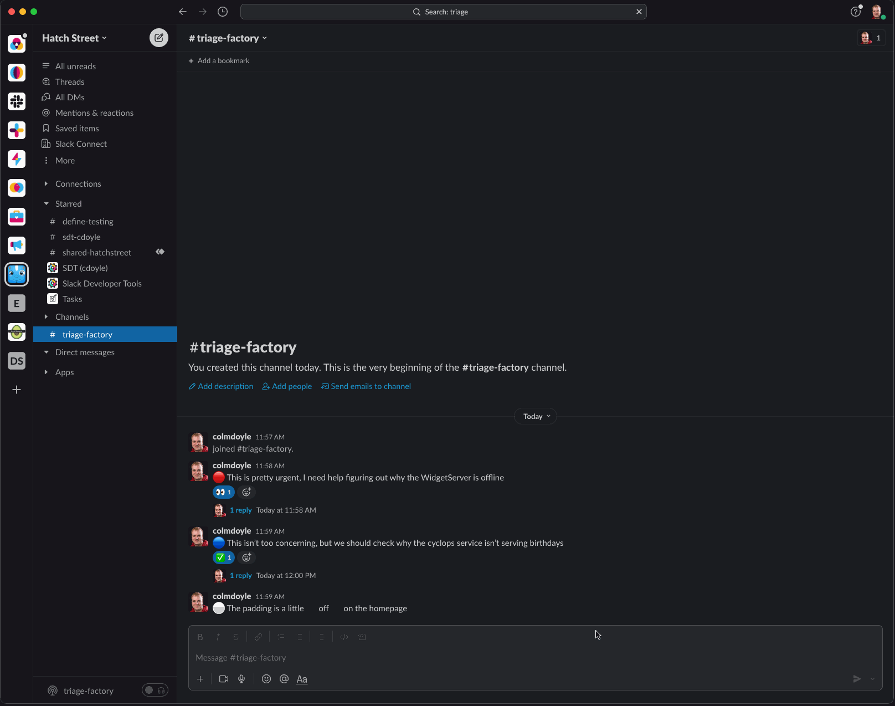

# Next-gen Slack platform project template - TriageBot

This repo contains a Slack Function to "triage" a channel, by scanning the message history for a given number of days, searching for key emoji which signify priority.

If the messages have certain Reacji, this indicates if the message has been acted on, is in progress, or is still pending.



## Setup

Create a new project using this as repo as a template.

```bash
slack create -t slackapi/deno-triage-bot
```

## Running it locally

```bash
slack run
```

## Deploying to Slack

```bash
slack deploy
```